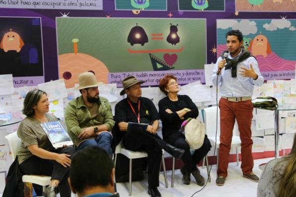

## Biblioteca Pública Móvil Las Morras

Pablo Iván Galvis Díaz estuvo tres años en San Vicente del Caguán y ha escrito dos libros con historias del conflicto armado. Su próxima meta es una novela. .

Pablo Galvis durante el foro sobre **Libros que cambian** en la Feria del Libro en Bogotá 2018
